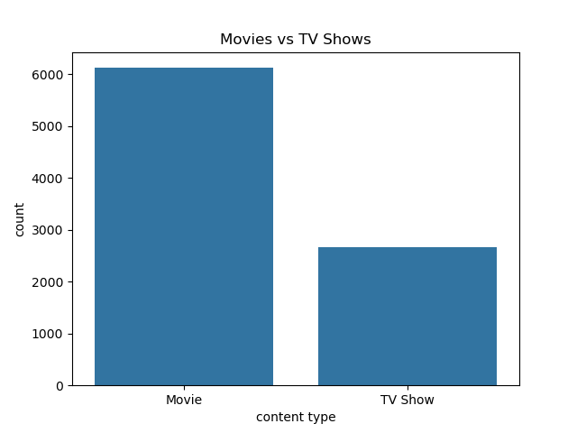
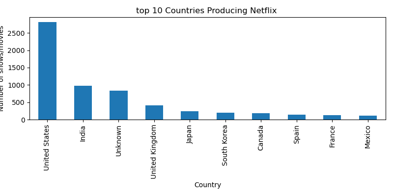
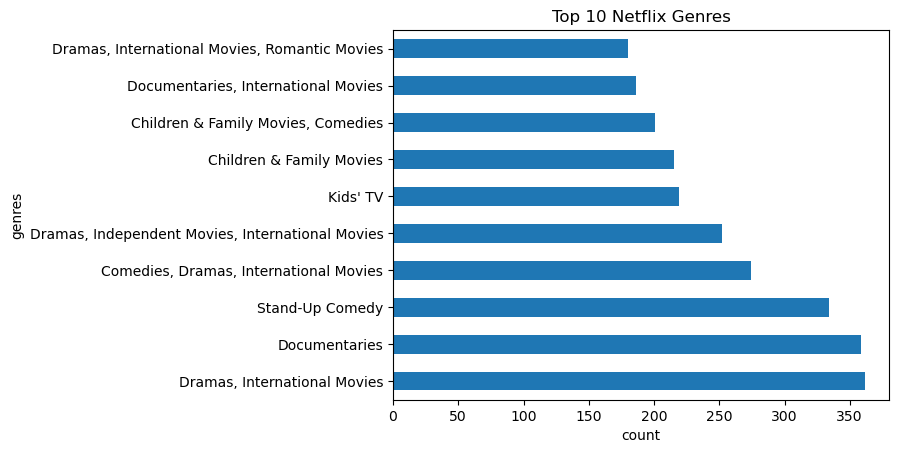
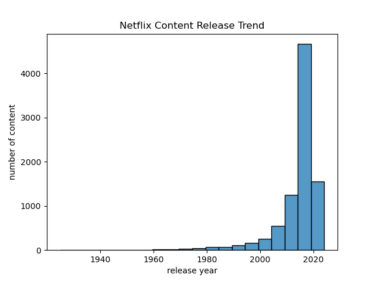

# Netflix Data Analysis

## Overview

This project performs exploratory data analysis on the Netflix Movies and TV Shows dataset using Python.

The analysis explores Netflix content trends, content types, countries, genres, ratings, and release patterns.

## Dataset

The dataset used in this project is the Netflix Movies and TV Shows dataset from Kaggle.

## Tools And Libraries

- Python
- Pandas
- NumPy
- Matplotlib
- Seaborn
- Jupyter Notebook

## Analysis Performed

- Data cleaning
- Missing value handling
- Movies vs TV Shows analysis
- Top countries analysis
- Genre analysis
- Release year trend analysis
- Rating distribution analysis

## Visualizations

### Movies vs TV Shows

### Top Countries

### Top Genres

### Release Year Trend

## Key Insights

- Netflix has more Movies than TV Shows.
- Most Netflix content was released after 2015.
- The United States produces the highest amount of Netflix content.
- Drama and Comedy are among the most popular genres.

## How To View This Project

Open the Jupyter notebook in the `notebook/` folder:

## Author

Vishal Kumar
